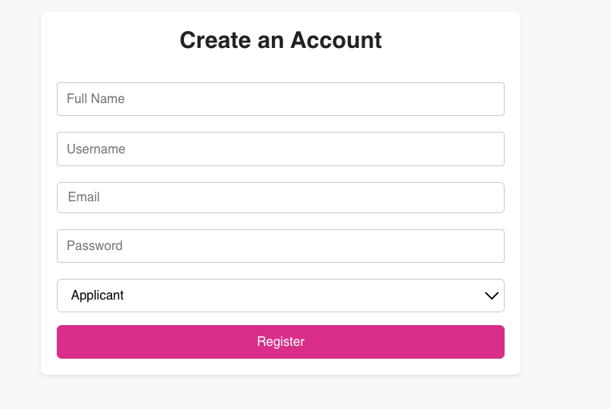
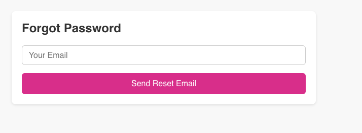
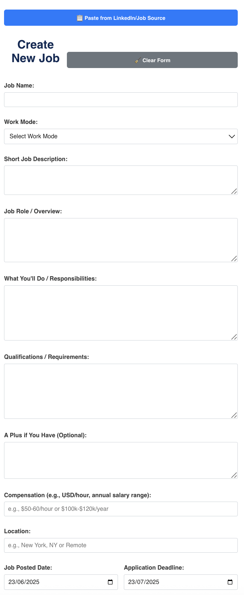
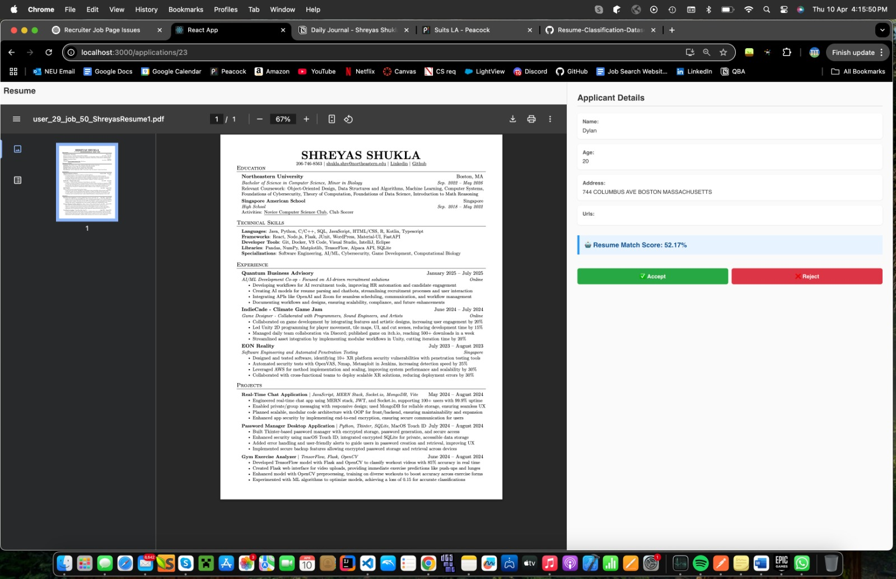
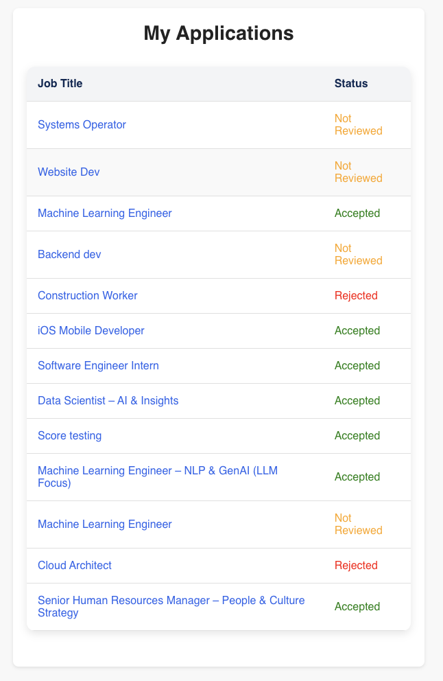
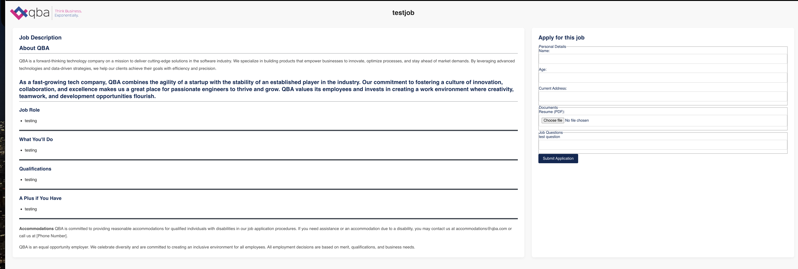
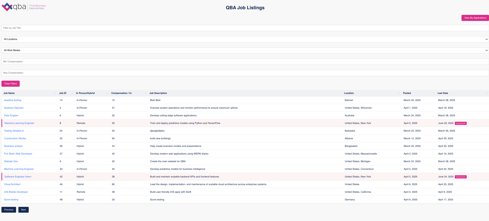
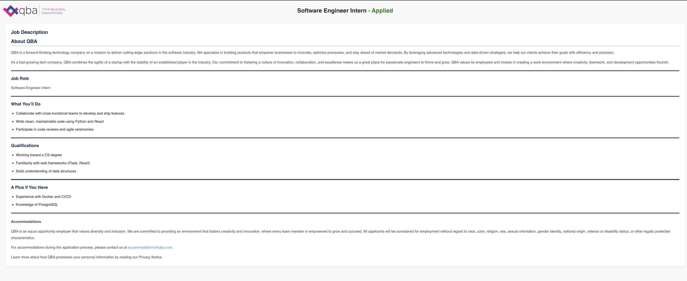

# QBA Recruiting System

## Table of Contents
- [QBA Recruiting System](#qba-recruiting-system)
  - [Table of Contents](#table-of-contents)
- [Introduction](#introduction)
  - [Important Files](#important-files)
  - [Large Scope Overview](#large-scope-overview)
    - [Backend](#backend)
    - [Frontend](#frontend)
  - [Prerequisites \& Notes](#prerequisites--notes)
  - [Installation \& Getting Started](#installation--getting-started)
  - [Images Of Frontend](#images-of-frontend)
  - [Hugging Face Repos](#hugging-face-repos)
  - [Project Structure](#project-structure)
  - [About the Team](#about-the-team)
    - [Next Steps \& Remaining Work](#next-steps--remaining-work)

# Introduction

From January to June 2025, I completed a co-op at Quantum Business Advisory (QBA) through Northeastern University’s Computer Science CO-OP program. During this time, I collaborated with a team of software engineers to architect and build an AI-driven recruitment platform that streamlines candidate sourcing, screening, and engagement.

[Quantum Business Advisory (QBA)](https://qbadvisory.us/) · [LinkedIn](https://www.linkedin.com/company/qbaworldwide/)


## Important Files
1) [Project Specs](https://drive.google.com/file/d/1XVYfHbBoo5x2amgI6H-FccZrjo18A4aY/view?usp=sharing)
2) [Notion Journal](https://drive.google.com/file/d/1tV4ikMeScSJ8PiRQXAbhvFE3msJ4UoD1/view?usp=sharing)

## Large Scope Overview

###  Backend

1. **Foundation & Architecture**  
   - Chose **FastAPI** + Uvicorn for a high-performance, asynchronous REST API.  
   - Structured the code into logical modules (`routes/`, `models/`, `database/`, `auth/`).

2. **Persistence & Data Modeling**  
   - Designed **SQLAlchemy** models for `User`, `Job`, `Application` (with cascade deletes).  
   - Managed schema changes via **Alembic migrations**.  
   - Deployed on **PostgreSQL**, with environment-specific connection strings.

3. **Core CRUD & Business Logic**  
   - Implemented full **CRUD** for jobs (`GET`, `POST`, `PUT`, `DELETE`), tying each job to its creator.  
   - Added **input validation** at the Pydantic-schema level.  
   - Introduced **custom HTTP error handling** for robust responses.

4. **Authentication & Authorization**  
   - Built **JWT**-based auth endpoints (`/auth/register`, `/auth/token`).  
   - Enforced **role-based access control** (admin/recruiter/applicant) on protected routes.

5. **Advanced API Features**  
   - **Filtering & Pagination**: query by title, company, date; implemented database indexes for performance.  
   - **Search & Sorting**: sort listings by deadline, compensation, etc.  
   - **CORS** & **Swagger UI**: enabled cross-origin frontend calls and auto-generated API docs.

6. **Testing & Deployment Prep**  
   - Wrote **pytest** suites and used **Postman** for endpoint validation.  
   - Prepared the codebase for cloud deployment (Heroku/Railway/AWS).

7. **AI & Automation Hooks**  
   - Integrated **BERT-based resume-scoring** and an **email/workflow automation** layer.  
   - Exposed endpoints for **resume parsing** and **auto-filling job templates**, including “Copy from LinkedIn.”

---

### Frontend

1. **Tech Stack & Styling**  
   - Built as a **React** SPA using **Tailwind CSS** and **shadcn/ui** components.  
   - Emphasized a **mobile-first**, **accessible** design.

2. **Role-Aware Interfaces**  
   - **Applicant View**:  
     - **Login & Create Account** pages with JWT token storage.  
     - Multi-section **application form** dynamically generated from each job’s `other_materials` and custom questions.  
     - “View My Applications” dashboard showing status (Pending · Accepted · Rejected).

   - **Recruiter View**:  
     - **Job Listings** page with “Create New Job” and **Edit** buttons (hidden from applicants).  
     - **Job Detail** panel: left side shows detailed JD; right side lists applications by status with real-time updates and in-place accept/reject actions.

3. **Data Integration & State**  
   - Used **Axios**/Fetch to call backend endpoints, with **Context API** (or Redux) for global state (auth tokens, job data).  
   - Implemented **React Router** for client-side navigation.

4. **Interactive Enhancements**  
   - **Filters**: title, location, work mode; **sorting** by deadline and compensation.  
   - **Highlighting**: visual cues for jobs nearing their application deadline.  
   - **Responsive Tables**: sortable, paginated job tables that render gracefully when empty.

5. **Component Design & Iteration**  
   - Wireframed key screens, then broke them into reusable components (e.g., `JobTable`, `JobForm`, `AuthForm`).  
   - Gradually polished UI (button alignment, form layouts, dynamic sections) based on user roles.

6. **Testing & Tooling**  
   - Switched from raw `curl` to **Postman** for API debugging.  
   - Addressed ESLint/TypeScript warnings and resolved module/import issues for a stable developer experience.


## Prerequisites & Notes

**Status:** Approximately 75% complete with a polished, responsive UI.  
**Disclaimer:** A handful of features are still under development and a few minor bugs remain.

## Installation & Getting Started

```bash
# Clone & enter repo
git clone https://github.com/shuklashreyas/QBARecurtingSystem.git
cd QBARecurtingSystem

# Backend setup
conda create --name job-management python=3.9 -y
conda activate job-management
pip install -r requirements.txt
alembic upgrade head
uvicorn app.main:app --reload

# Frontend setup
cd frontend
npm install
npm run dev
```

## Images Of Frontend














## Hugging Face Repos

1) [Resume Scorer AI](https://huggingface.co/shreyasshukla/resume-scorer/tree/main)
2) [Job Auto Completer](https://huggingface.co/shreyasshukla/job-label-model/tree/main)

## Project Structure

- **job-management/**  
  - **alembic/**  
    Database migration scripts (Alembic)  
  - **app/**  
    FastAPI backend  
    - **auth/**: authentication endpoints (register, login, JWT)  
    - **crud/**: core CRUD logic separated from routes  
    - **database/**: SQLAlchemy session & connection setup  
    - **fetchjobs/**: external job-fetching integration  
    - **models/**: SQLAlchemy ORM models (`User`, `Job`, `Application`, etc.)  
    - **routes/**: FastAPI routers grouping related endpoints  
    - **schemas/**: Pydantic request/response schemas  
    - **tests/**: pytest suites for unit/integration tests  
    - **utils/**: shared helper functions  
  - **frontend/**  
    React single-page application  
    - **public/**: static files (HTML, favicon)  
    - **src/**  
      - **components/**: reusable UI components  
      - **context/**: React Context providers & hooks  
      - **data/**: mock or static JSON data  
      - **pages/**: top-level views (Login, Job Listings, etc.)  
      - **services/**: API wrappers (e.g. `apiService.js`)  
      - **App.js**, **index.js**: application entry points  
      - **\*.css**, **\*.test.js**, **reportWebVitals.js**, **setupTests.js**: styling & test/config files  
- **.gitignore**  
- **README.md**, **requirements.txt**, **alembic.ini**, etc.  


## About the Team

- **Shreyas Shukla** - Intern
- **Thomas Bloom** - Administrative Coordinator
- **Kaustav Chakraborty** - Business Head of the AI/ML Vertical
- **Probal DasGupta** - Principal Facilitator

### Next Steps & Remaining Work

- **Finish Deployment**: Used Docker, need to use render now
- **Remaining Features**: interview scheduling, retrieving jobs from linkedin automatically
- **Polish AI Features**: refine resume parser, automate interview scheduling.  
